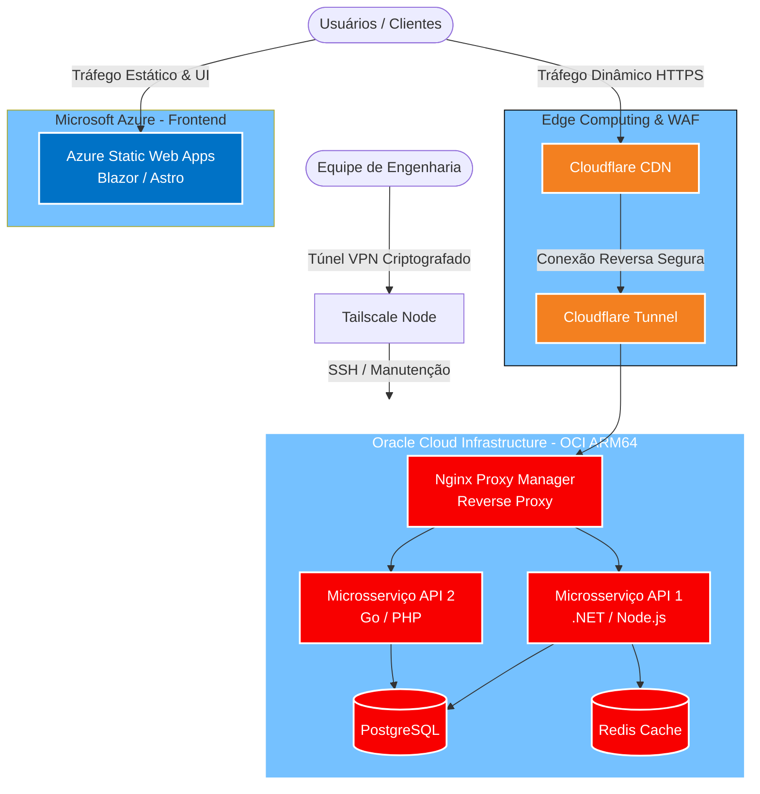

# 🚀 Multi-Cloud SaaS Architecture: High-Availability & FinOps Boilerplate


-orange?style=for-the-badge)


Este repositório contém a arquitetura base (Proof of Concept / Boilerplate) de um ecossistema SaaS distribuído. O projeto foi desenhado com foco em **Engenharia de Plataforma, Alta Resiliência, Segurança Zero-Trust e Otimização Drástica de Custos (FinOps)**.

⚠️ **Nota Técnica:** Por razões de propriedade intelectual, a lógica de negócio comercial (*core domain*) e as regras de precificação estão mantidas em repositórios privados. Este repositório público demonstra a estruturação da infraestrutura, padrões de código, esteiras de CI/CD e a topologia de microsserviços com dados simulados (*mocks*).

---

## 🏗️ Topologia da Arquitetura (Mermaid)

A arquitetura isola completamente a camada de entrega visual (Edge Computing) da camada de processamento de dados (Heavy Compute).

---


---

## 🛠️ Stack Tecnológico

### Borda e Front-end (Microsoft Azure)

* **Hospedagem:** Azure Static Web Apps (Distribuição global via CDN).
* **Framework:** .NET MAUI Blazor WebAssembly / Astro.
* **Integração:** HTTPS nativo, roteamento de borda e ambientes automáticos de homologação gerados por Pull Requests.

### Processamento e Back-end (Oracle Cloud OCI)

* **Computação:** Instância Ampere ARM64 (4 vCPUs, 24GB RAM) - Alto poder de processamento em contêineres.
* **Linguagens das APIs:** .NET (C#), Node.js (TypeScript) e PHP.
* **Bancos de Dados & Cache:** PostgreSQL e Redis (Containers persistentes via volumes Docker).
* **Gerenciamento:** Docker Compose orquestrando o ciclo de vida dos microsserviços.

### Segurança e Malha de Rede (Zero-Trust)

* **Cloudflare Tunnels:** As APIs não possuem IPs públicos expostos à internet. O tráfego entra através de túneis reversos blindados.
* **Tailscale (Mesh VPN):** O acesso administrativo (SSH, painéis de banco de dados e logs) é feito exclusivamente via rede privada peer-to-peer.
* **Nginx Proxy Manager:** Gestão interna de certificados SSL e roteamento de contêineres.

---

## 📈 Planejamento de Capacidade (Capacity Planning)

Este cluster foi desenhado utilizando camadas corporativas gratuitas (*Always Free*) de grandes players, configurado estrategicamente para extrair eficiência máxima de hardware:

* **Rendimento Front-end (Azure):** Capacidade elástica de borda, suportando **+100.000 RPS** (Requisições Por Segundo) sem onerar os servidores de aplicação.
* **Rendimento Back-end (Oracle ARM64):** As 4 vCPUs combinadas com os 24GB de RAM garantem suporte a cargas estimadas de **2.000 a 5.000 RPS dinâmicas**.
* *Referência de Mercado:* Esta topologia de infraestrutura possui poder computacional para absorver, isoladamente, o equivalente a picos de tráfego de grandes portais nacionais ou operações bancárias transacionais de médio porte, garantindo SLA elevado.

---

## 🔄 Pipeline de CI/CD (DevOps)

A automação de integração e entrega contínua é gerenciada nativamente pelo **GitHub Actions**:

1. **Commit / Push:** O desenvolvedor envia o código para a branch `main` ou cria um `Pull Request`.
2. **Lint & Test (Quality Gate):** Acionamento da suíte de testes automatizados de unidade e integração. O *build* só avança se a taxa de sucesso for 100% e o índice de retrabalho estatístico estiver controlado.
3. **Build (Front-end):** Compilação do código Blazor/WASM e publicação via *token* seguro diretamente no Azure Static Web Apps.
4. **Build & Deploy (Back-end):** Geração de imagens Docker multi-arquitetura (foco em `linux/arm64`) e acionamento de Webhook/SSH na Oracle Cloud para recriar os contêineres sem indisponibilidade (*Zero Downtime Deployment*).

---

## 🛡️ Como rodar o projeto localmente (Ambiente de Desenvolvimento)

Para inicializar a versão demonstrativa (com dados simulados/mocks) em sua máquina local:

1. Clone o repositório:

```bash
git clone https://github.com/Marckxp/Multi-Cloud-SaaS-Architecture-High-Availability-FinOps.git

```

2. Suba a infraestrutura de apoio via Docker:

```bash
cd infra
docker-compose up -d

```

3. Execute o Front-end e as APIs:

```bash
# Exemplo para a API em .NET
cd src/Backend
dotnet run

# Exemplo para o Front-end WebAssembly
cd src/Frontend
dotnet watch run

```

---

## 👨‍💻 Autor e Mantenedor

**Marcelo Ricarte Besteti**
*Software & Cloud Engineer*

Com sólida vivência na arquitetura, desenvolvimento e sustentação de sistemas distribuídos de alta complexidade. Especialista em unir desenvolvimento Full-Stack com engenharia de infraestrutura moderna, focando em resiliência, padronização de entregas e otimização drástica de custos corporativos.

🔗 [LinkedIn](https://www.linkedin.com/in/marcelo-ricarte-besteti-86a94069/) | 📧 Contato Profissional

```

```
